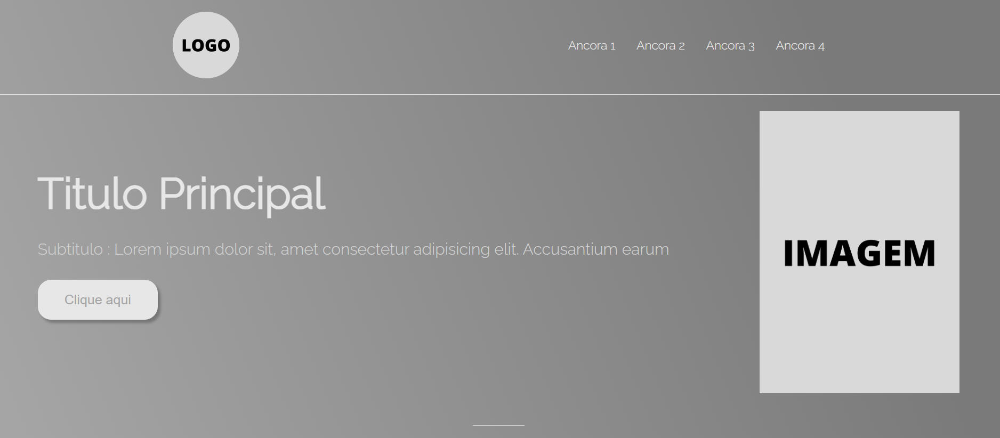

# Landing Page Modelo

> Inspirações e Estudos utilizados:
[Flexbox](https://css-tricks.com/snippets/css/a-guide-to-flexbox/)
[LandingPage por Rafa Ballerini](https://youtu.be/llF6vD-RljE)

## Índice 

* [Landing Page Modelo](#Título-e-Imagem-de-capa)
* [Badges](#badges)
* [Índice](#índice)
* [Descrição do Projeto](#descrição-do-projeto)
* [Status do Projeto](#status-do-Projeto)
* [Funcionalidades e Demonstração da Aplicação](#funcionalidades-e-demonstração-da-aplicação)
* [Acesso ao Projeto](#acesso-ao-projeto)
* [Tecnologias utilizadas](#tecnologias-utilizadas)
* [Licença](#licença)

## Descrição do Projeto
O projeto é um modelo simples de landing page com HTML5 e CSS3, com 3 divisões principais: header(cabeçalho), main(conteúdo), footer(rodapé).Foi feito no Visual Studio Code. Não é comercial e sim pra estudo de modelo base para outros landing page.
> Inspirações e Estudos utilizados:
* [Flexbox](https://css-tricks.com/snippets/css/a-guide-to-flexbox/)
* [LandingPage por Rafa Ballerini](https://youtu.be/llF6vD-RljE)

## Status do Projeto
<h4 align="center"> 
    :construction:  Projeto concluído em Julho de 2022  :construction:
</h4>

## :hammer: Funcionalidades do projeto

- `Funcionalidade 1`: Cabeçalho com Flexbox e links para outras páginas
- `Funcionalidade 2`: Conteúdo possui botão com funcional

## 📁 Acesso ao projeto

**Indique como é possível baixar ou acessar o código fonte do projeto, seja projeto inicial ou final**

## 🛠️ Abrir e rodar o projeto

**Apresente as instruções necessárias para abrir e executar o projeto**

